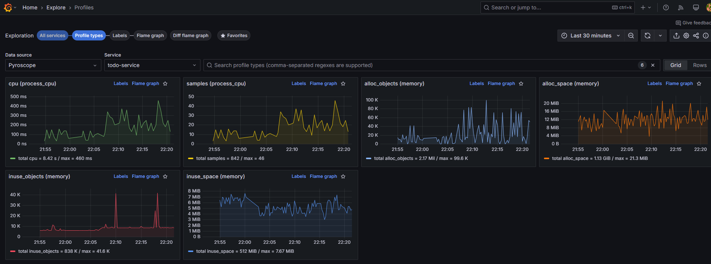

# go-otel-sample-app

OTel sample app in Go for demonstrating logs/traces/metrics/profiles all in the same process (except for OTel and Pyroscope).

## Prerequisites

- Go 1.23 or greater
- Instance of [OTel Collector running locally](https://github.com/open-telemetry/opentelemetry-collector-contrib)
- Instance of [Grafana Pyroscope](https://grafana.com/oss/pyroscope/) running locally
- Some observability backend to see the data (Grafana is a good choice and what I used)

For running OTel, Pyroscope and Grafana locally I used some charts that I configured at https://github.com/fagnercarvalho/observability-stack-k3s.

## Running

```
go build
OTEL_COLLECTOR_URL=otel.local PYROSCOPE_URL=http://pyroscope.local ./go-otel-sample-app
```

You can also run:
```
./go-otel-sample-app
```

This will assume `otel.local` and `http://pyroscope.local` as the default for OTel and Pyroscope, respectively.

## Purpose

The purpose of this sample is to demonstrate the 4 telemetry signals (logs, traces, metrics and profiles) from an application running in Go.

This Go app will:
- Run an in-memory SQLite with http://modernc.org/sqlite
- Run an in-memory Redis with https://github.com/alicebob/miniredis
- Run a client application with `http.Client`
- Run a server application with https://github.com/labstack/echo

With these, the app will leverage the following [instrumentation libraries](https://opentelemetry.io/docs/concepts/instrumentation/libraries/) to generate spans and metrics for these components:
- For SQLite, https://github.com/XSAM/otelsql
- For Redis, the `redisotel` package under https://github.com/redis/go-redis
- For `http.Client`, http://go.opentelemetry.io/contrib/instrumentation/net/http/otelhttp
- For `echo`, http://go.opentelemetry.io/contrib/instrumentation/github.com/labstack/echo/otelecho


## Screenshots

If everything goes well this is how a sample trace should look like:


And logs (by leveraging Explore Logs):


And metrics (by leveraging Explore Metrics):


And finally profiles (by leveraging Explore Profiles):

